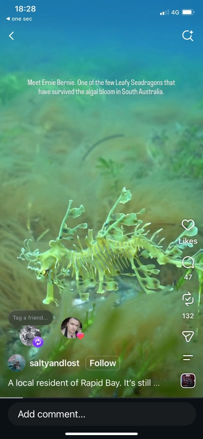
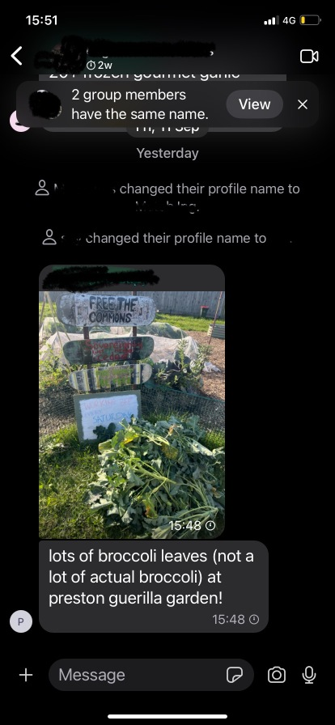
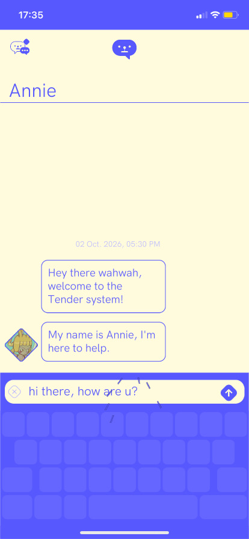
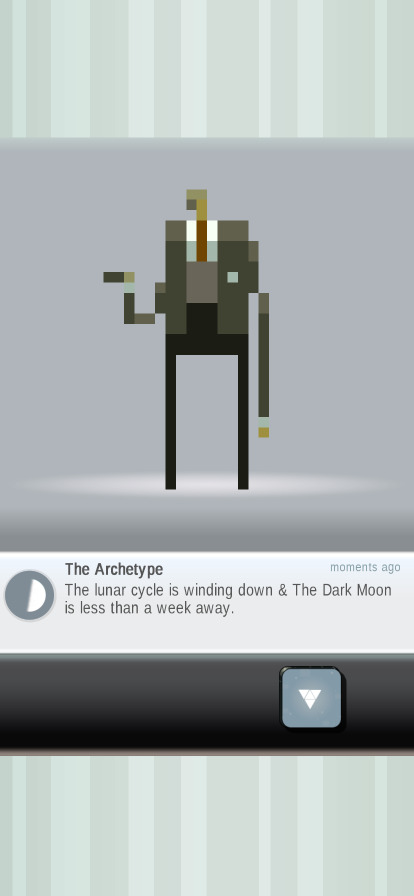
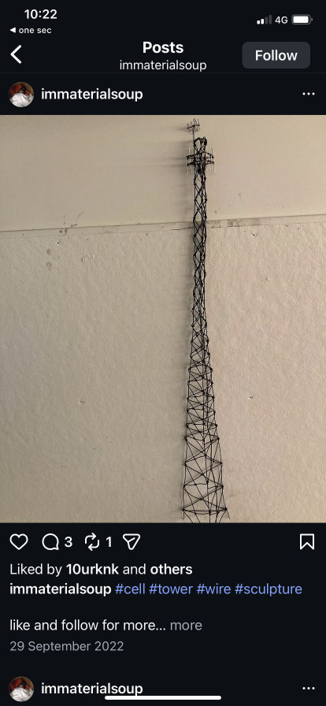
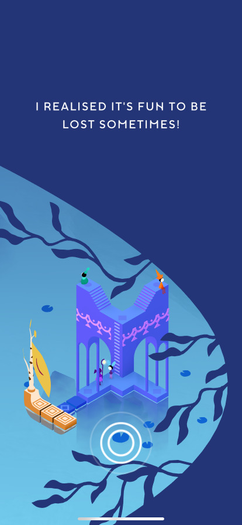
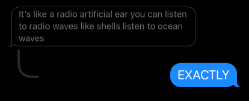
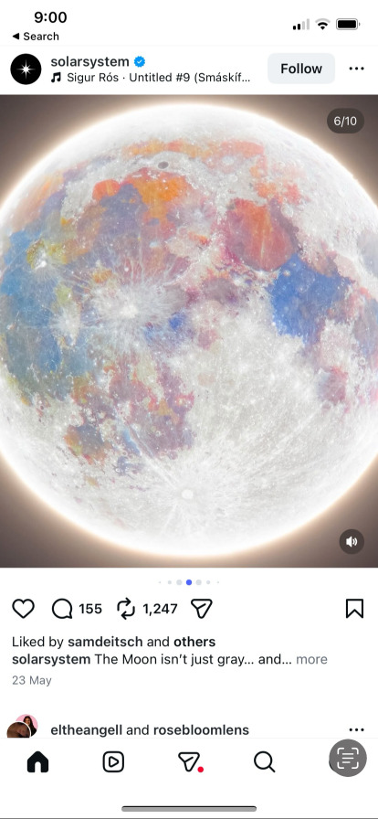
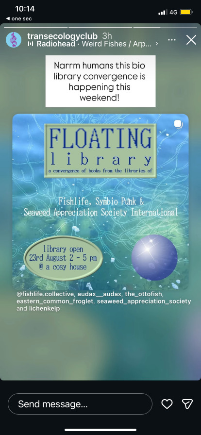
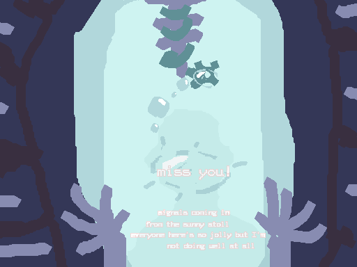

# User Interface

Friday 2nd Oct - considering interface design before I write too much, because I would like them to inform each other and to have reasonable limitations on space and therefore word-count. And I am more and more thinking that this game would be mostly looking at the interface that is the inside of your shell. s

Here's some working notes on the UI ideas: essentially trying to imagine some ways that **the dialogue system could be about navigating the Protagonists' interface to their oceanic internet.**

The strongest idea so far is essentially: there is a bubble-membrane at the mouth of your conch shell. Messages are little data-packet bubbles that pop and unpack when they touch the shell. We see other characters mostly through images that are displayed in larger refractive bubble-streams with hall-of-mirrors effects. 

So for our prototype, could we experiment with: 
- Character portraits that aren't busts, they're a bit more candid (selfies, facetimes, awkward web-cam angles)
- Bubble-interface look (that's not really frutiger-aero)
- Smartphone/social media aesthetics and design patterns to find layouts that are distinct from existing visual novel aesthetics.


## iPhone aesthetics
Below are a handful of images I just picked from my iPhone screenshots folder to show the aesthetics of my everyday experience using it. There's definitely been a trend beyond just rounded-corners on everything, towards "bubbly" UI in iOS, Discord and Instagram. Your friends' profile pictures float around Instagram's interface in all these pseudo-social ways, simulating contact with them but you're not actually connecting you're just engaging with the same stuff. Also included game screenshots from *Tender: Creature Comforts*, *S&S:EP* and *Monument Valley 3*.













## UI Ideas...

Diegesis means that elements exist within the world and that they are perceived by the characters: they are not overlaying the world. 

Lead for further UI concepts: explore ways to juxtapose the **design language of our digital media streams with underwater forms** (like twitter feeds and group chat-bubbles, crossed with undersea emissions like volcanoes and bubbles released by large organisms).

Considering this game's central framing being vertically designed like a phone screen -- **our primary interface to the internet**. We see things float in and out of this display. How could this be replicated in the visual layout?

- **How could dialogue seem diegetic?** These are some visual metaphors...
	- A: unstructured data / unfiltered thoughts
		- Dialogue options float around: not presented linearly. 
		- a stream of consciousness
		- ocean waves/whitewash
		- marine snow
	- B: structured data / filtered thoughts
		- a binary-data square wave
		- visual design of different social medias
		- acoustic waves are essentially pockets of air: 
			- **could texting dialogue-bubbles be literal bubbles?**


Here's a mockup: in this picture, you're looking out and can see your shell's antenna has an attention-tether hooked around it that is the mediator for messages from your dear friends, spewing them out in bubbles. The "phone screen" could be the opening in the conch-shell with an air-membrane over it that's absorbing bubbles that pop when they contact it, unpacking the data inside of them. You click on the bubble titled "miss you..." when it hits the screen (membrane) and expand it to follow the rest of the message. It's a goofy little place-holder message, I swear I don't wanna make everything rhyme :p




Images, music and video are streams of bubbles coming from signalstars. When you want to break out of a streaming-spiral, you find yourself reflected back in the "black screen" of a siphonophore hooked onto the face of your shell, blocking out the light.

### ASCII art?

a train of thought to follow later... bulletin-board and plaintext forum aesthetics?

```
  o o
   o   ~ miss you
  o o
  /
/
|*
 T
 +\ 
 T|
 /
/T
```


### cursor movement

a bit of polish that would really contribute to gamefeel would be to have a "floaty" cursor as well, simulating the feeling of dragging your hand underwater.